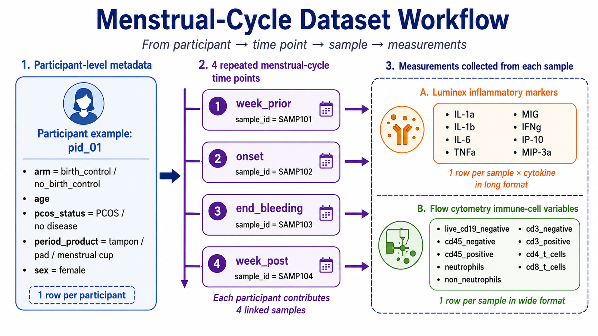

## Research Question

> **Do inflammatory marker levels differ between participants with PCOS and participants without PCOS after accounting for menstrual-cycle stage?**

------------------------------------------------------------------------

## Figure 1: Dataset Workflow

```{r workflow-fig, fig.cap="", out.width="100%"}

```

**Figure 1.** Structure of the menstrual-cycle dataset. Participant-level metadata are linked to four repeated menstrual-cycle samples per participant. Each sample is connected to Luminex inflammatory-marker measurements and flow-cytometry immune-cell measurements.

This figure introduces the data hierarchy: participant → time point → sample → measurements. Because each participant contributes repeated samples, samples from the same participant should not be treated as independent.

------------------------------------------------------------------------

## Table 1: Participant Characteristics

| Characteristic | Overall (N = 27) | No disease (N = 13) | PCOS (N = 14) | p-value |
|:---|---:|---:|---:|---:|
| Age (years), Mean (SD) | 31.4 (2.9) | 30.5 (2.5) | 32.1 (3.1) | 0.2^a^ |
| Birth control use, n (%) | | | | 0.2^b^ |
|   birth_control | 15 (56%) | 9 (69%) | 6 (43%) | |
|   no_birth_control | 12 (44%) | 4 (31%) | 8 (57%) | |
| Period product, n (%) | | | | 0.2^c^ |
|   menstrual_cup | 4 (15%) | 2 (15%) | 2 (14%) | |
|   pad | 4 (15%) | 0 (0%) | 4 (29%) | |
|   tampon | 19 (70%) | 11 (85%) | 8 (57%) | |

*Note:* All participants were recorded as female.

^a^ Wilcoxon rank sum test; ^b^ Pearson's chi-squared test; ^c^ Fisher's exact test.

**Table 1.** Participant characteristics by PCOS status.

Table 1 describes the participant-level cohort used for the PCOS versus no-disease comparison. The analysis includes 27 participants, with repeated samples collected across four menstrual-cycle time points.

------------------------------------------------------------------------

## Menstrual-Cycle Time Points

The four menstrual-cycle time points were ordered as: week_prior → onset → end_bleeding → week_post. Time point was included in the mixed-effects model to account for menstrual-cycle stage.

------------------------------------------------------------------------

## Figure 2: Cytokine Comparison with Model-Based p-values

```{r cytokine-fig, fig.cap="", out.width="100%"}
knitr::include_graphics("Figure_1_Cytokine_Comparison_with_pvalues.pdf")
```

**Figure 2.** Log-transformed inflammatory-marker concentrations by PCOS status. Each panel shows one cytokine. Points represent sample-level observations, boxes summarize the group distributions, and annotations show Benjamini-Hochberg-adjusted p-values from cytokine-specific mixed-effects models that accounted for menstrual-cycle time point and repeated measures within participants.

**Model used for each cytokine:**

`log1p(concentration) ~ pcos_status + time_point + (1 | pid)`

This model tests whether cytokine concentration differs by PCOS status while adjusting for menstrual-cycle stage and accounting for repeated samples from the same participant.

------------------------------------------------------------------------

## Results Interpretation

Across the eight inflammatory markers measured by Luminex, no cytokine showed a statistically significant difference between PCOS and non-PCOS participants after Benjamini-Hochberg correction. The adjusted p-values shown in Figure 2 indicate that PCOS status did not strongly explain inflammatory-marker variation in this dataset after accounting for menstrual-cycle stage.

------------------------------------------------------------------------

## Conclusion

> **Conclusion:** In this dataset, inflammatory marker levels did not differ significantly between participants with PCOS and participants without PCOS after adjusting for menstrual-cycle time point. The analysis correctly accounts for the repeated-measures structure by including participant ID as a random effect.